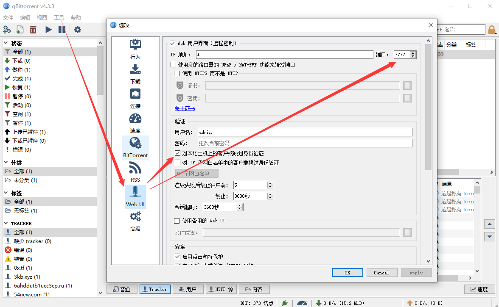
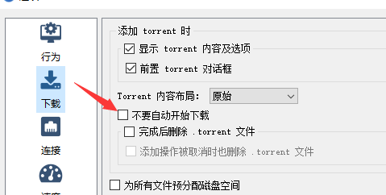
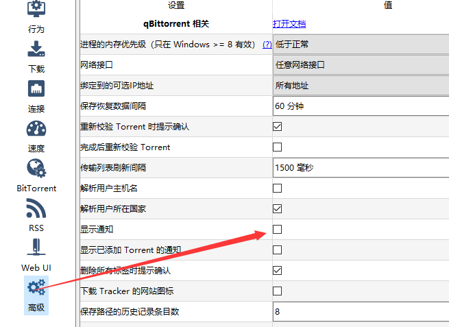

## run
```
$ scrapy crawl example
```

## 代理
修改'settings.py'中的'PROXY'

## 种子下载使用 [qBittorrent](https://www.qbittorrent.org/download.php)

## qbittorrent [Web API](https://github.com/qbittorrent/qBittorrent/wiki/WebUI-API-(qBittorrent-4.1))

## [trackers](https://github.com/ngosang/trackerslist) 列表

## 开启Web UI


## 开启自动下载


## 关闭下载通知



## unzip.py

解压所有"./downloads/*/*.zip"，解压后源zip文件将被删除